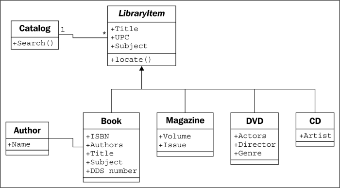
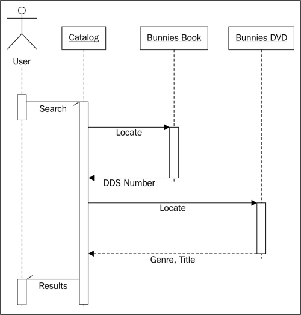

# Projek1-SIB-DigitalSkola

This project implements a digital library catalog system using Object-Oriented Programming (OOP) concepts.

**Requirements**

* Python >= 3.8 https://www.python.org/downloads/
* Visual Studio Code https://code.visualstudio.com/download
* Git https://git-scm.com/downloads
* GitHub https://github.com/Index
* Sourcetree https://www.sourcetreeapp.com/

**Create OOP:**


**Create Automation:**



**Explanation of Files**

* `catalog.json`: Stores library catalog data in JSON format. Each item represents a book, magazine, CD, or DVD in the following format:

    ```json
    {
        "source": "book|magazine|cd|dvd", (required)
        "title": "Title of the item", (required)
        "subject": "Subject of the item" (optional),
        "upc": "UPC code of the item" (optional),
        "issbn": "ISBN code for books" (optional, only for books),
        "authors": "Author(s) of the book" (optional, only for books),
        "dds_number": "DDS number for books" (optional, only for books),
        "volume": "Volume number for magazines" (optional, only for magazines),
        "issue": "Issue number for magazines" (optional, only for magazines),
        "actors": "Actors in the DVD" (optional, only for DVDs),
        "directors": "Directors of the DVD" (optional, only for DVDs),
        "genre": "Genre of the DVD" (optional, only for DVDs)
    }
    ```

* `main.py`: The main Python script that runs the program. It reads data from `catalog.json`, creates instances of the `Book`, `Magazine`, `CD`, and `DVD` classes, and creates a `Catalog` object to manage the library catalog.
* `modules/`: Contains Python modules defining the classes used in the program.
    * `book.py`: Defines the `Book` class, representing a book in the library catalog.
    * `cd.py`: Defines the `CD` class, representing a CD in the library catalog.
    * `catalog.py`: Defines the `Catalog` class, managing the library catalog.
    * `dvd.py`: Defines the `DVD` class, representing a DVD in the library catalog.
    * `library_item.py`: Defines the `LibraryItem` class, the base class for all other classes.
    * `magazine.py`: Defines the `Magazine` class, representing a magazine in the library catalog.
* `README.md`: This file contains the project documentation (you are reading it now).
* `.gitignore`: Specifies files ignored by Git version control.

**Running the Program**

1. Clone the repository to your local machine.
2. Open a terminal window in the project directory.
3. Install required Python libraries:
```bash
pip install
```
4. Run the program using the following command:
```bash
python main.py
```
This will start the library catalog program. You can interact with it by entering search terms to find items in the catalog.
